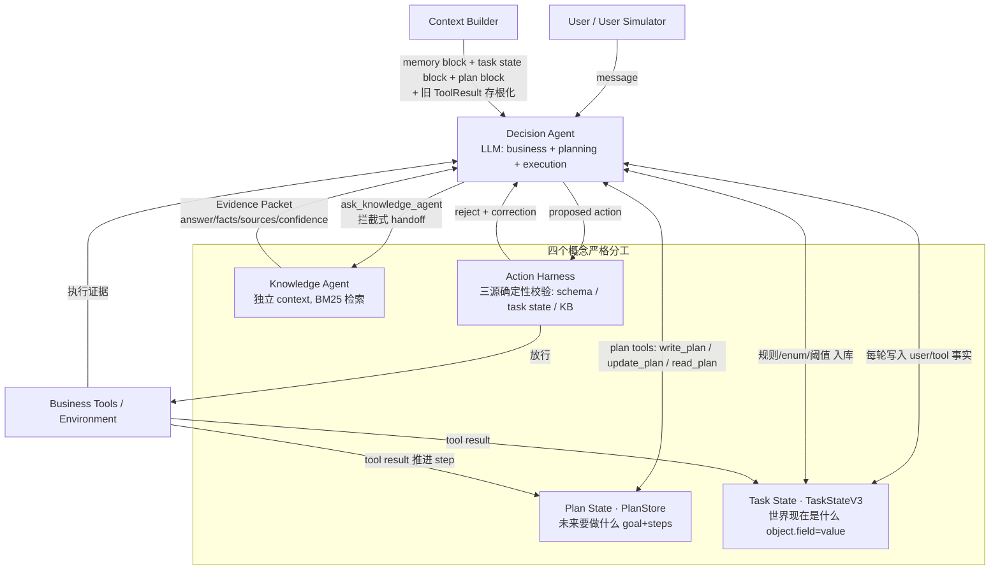

# TelecomOps-Agent

**Evaluation-Driven Agent Runtime for Reliable Long-Horizon Tool Use** — 基于 [τ³-bench / tau2-bench](https://github.com/sierra-research/tau2-bench)（banking_knowledge 域）构建、评测驱动的多 Agent Runtime：从单 Agent baseline 逐步演进到 selective memory → deterministic action harness → recovery → structured task state → context management → structured planning & replanning，每一步都用固定的 Dev/Holdout 评测集验证。

> **项目性质**：这不是一个 baseline demo，而是一个完整的 **Agent Engineering 实验项目**：
> 先造尺子（冻结评测集 + 固定协议），再造 Agent（每版一个机制假设），
> 用 trace 事件流归因每次成功/失败，包括诚实地记录和回退负结果。
> Runtime 已冻结在 **V5**（最终版），当前仓库处于收口状态。

---

## Final Results

| Version | Dev24 | Holdout22 | Main change |
|---|----:|--------:|---|
| V0 | 8/24 (33.3%) | — | 单 Agent baseline（官方 LLMAgent） |
| V1.2 / V3 | 5/24 (20.8%) | — | 2-Agent + selective memory / Structured Task State + Harness |
| V4 | — | 4/22 (18.2%) | Adaptive long-horizon + Context Builder |
| **V5 (final)** | **9/24 (37.5%)** | **8/22 (36.4%)** | **Structured Planning & Replanning** |

**读这张表的正确姿势（不过度归因）：**

- **V3/V5 的 Dev 对比混过模型**：V3 官方 Dev 用 `deepseek-v4-flash`，V5 Dev 用
  `qwen3.8-flash`——Dev 上 5/24→9/24 的提升**不能**全部归因于 V5 机制
  （其中 002/007 两个翻转属模型红利）。
- **V4 vs V5 的 Holdout 是同模型公平对比**（均为 `qwen3.8-flash`，
  sealed 22-task set，V5 开发期间未接触 holdout trace）：
  **4/22 → 8/22（+4，18.2%→36.4%）是本项目最干净的机制提升证据**。
  5 个 V4 全败任务首次翻上（031/047/052/063/089），1 个回落（038，
  LLM 路径波动）。
- V5 Dev 9/24 与 Holdout 8/22 同量级 → Dev 提升泛化到未见任务，不是过拟合。
- 剩余失败集中在业务判断层（026/053/054/070 等），不在执行结构层——见
  [技术复盘](docs/v0_v51_technical_retrospective.md) 的 failure mode 分析。

## Architecture（V5 最终形态）



**四个概念，严格分工（面试高频）：**

| 模块 | 回答的问题 | 关键性质 |
|---|---|---|
| **Task State**（`task_state_v3.py`） | 世界**现在是什么**（事实：`object.field=value [source]`） | 唯一事实源；supersede 历史；实体索引；来源 provenance（user/tool/knowledge） |
| **Plan State**（`plan_store.py`） | 未来**还要做什么**（goal + steps） | 只引用 Task State 实体，不复制事实；步骤完成由真实 tool result + 实体绑定驱动 |
| **Knowledge Agent** | 规则/文档知识（Evidence Packet） | context 物理隔离；结构化 claim + source_doc_id；不确定就报 missing_information |
| **Harness**（`action_harness.py`） | 确定性执行边界 | 三源校验（tool schema / task state / KB 约束）；**有明确依据才拦**，其余放行 |

## Evolution / What We Learned

每一版都是同一个循环：**Observation → Hypothesis → Experiment → Result**
（含被推翻的假设）：

| 阶段 | 观察 | 假设 | 结果 |
|---|---|---|---|
| **V0** | 单 Agent 在 24-task banking dev 上 8/24；长任务重复检索、context 膨胀 | 先冻结评测尺（分层抽样 dev set、seed/retrieval/max_steps 固定） | 基线建立；失败分两类：长序列执行 + 参数值错误 |
| **V1.1** | DA 忘已确认事实 | 给两个 Agent 各一块 memory | **负结果**：全量注入让 KA tokens +72%、handoff +53%——不加约束的记忆比没有更糟 |
| **V1.2** | V1.1 膨胀根因是"全量注入" | 按 request 选择性检索（hit/partial/miss） | KA tokens -74%、retrieval -68%；success 不升但效率是真实收益 |
| **V1.3** | 想用 prompt 让 DA 更高效 | procedural efficiency instruction | **自我判断回退**：证据不足时 prompt 调参是负优化 |
| **V2/V2.1** | 参数值错误可执行前拦截 | Evidence-grounded harness（穿透 wrapper 拿内层参数） | 穿透成功；但**核心假设被推翻**——"KA 能给每个业务参数正确值"不成立（假枚举、占位符、参数名当值……错误形态开放集） |
| **V2.2** | user/tool 的值可靠，KB 的值不可靠 | 三源约束：只拦"有明确依据"的冲突 | **0 误拦 + 死循环消除（58→3）**——"有明确依据才拦"成为贯穿到 V5 的不变原则 |
| **V2.3** | 被拒后修正率 0 | 结构化 correction + recovery 预算 | 拦→修→过→执行闭环成立 |
| **V3** | 误拦根因是参数级裸键（amount 无对象归属） | 对象级状态 `object.field=value[source]` + supersede + 实体解析 | 095 首次成功；跨对象混淆根治；Dev 5/24（success 不如 V0 但质量指标全面占优） |
| **V4** | 顽固任务不是"忘了做过什么"，是"不知道下一步" | Plan Mode + Context Builder + `[PLAN]` 文本协议 | **`[PLAN]` 遵守率 0**（V1.3 教训重现）；行为观察也无 reward 收益 |
| **V5** | 行为观察不是计划——需要**未来的步骤** | planning tools 落 runtime PlanStore；tool result + 实体绑定推进；条件 replanning；bounded completion guard | **Dev 9/24（历史新高）+ 同模型 Holdout 4/22→8/22**；5+ 顽固任务首次成功 |

## What Did Not Work（负结果，与正结果同等重要）

1. **V1.1 全量 memory 注入** — handoff +53%、KA tokens +72%；"勿重复查询"清单反向激励换说法重搜。
2. **V1.3 prompt-only 效率优化** — 无证据支撑的 prompt 调参是负优化，主动建议回退。
3. **V2.1 信任 KA grounded values** — "知识库能给出 case-specific 正确值"这个前提被 5 种病理形态证伪；证据校验降级为三源之一。
4. **V4 文本 `[PLAN]` 协议** — 遵守率 0；计划必须存在于 runtime state，不能靠 prompt 约定。
5. **Post-V5 Step 0–3**（consistency / reuse hints / KA 检索预算 / goal coverage）— targeted smoke 中 tools 显著下降，但全量 Dev **9/24 → 5/24**：逐 trace 归因确认 3 个回退来自"复用提示拦截循环"（实体已知 ≠ 查询结果已知）、1 个来自"检索预算截断证据包"；**整体 rollback**。完整分析见
   [postmortem](docs/post_v5_experiments_postmortem.md)。

## Benchmark Integrity

评测公平性是本项目生命线，有专门的 integrity 测试守护（`tests/test_integrity.py`，5/5 全绿）：

- **Agent runtime 不访问** `evaluation_criteria`、`required_documents`、gold actions。
- **不读 gold**：Discoverable tool schema 只能通过官方 `unlock_discoverable_agent_tool`
  流程获得——Resolver 只读 unlock state（`_agent_discoverable_tools_state`），
  绝不 introspect hidden 实现。
- **Prompt 不泄漏**：agents/ 的字符串常量扫描，真实 discoverable tool 名零出现。
- **Dev / Holdout 分离**：24-task Dev（开发期间反复使用）与 22-task sealed
  Holdout（seed=20260903 程序化抽样，开发期间零接触）物理隔离，
  Holdout 只在 freeze 后各跑一次（V4/V5），integrity 测试保证本仓库无 holdout 运行产物。

## Reproduction

```bash
# 1) 安装（Python 3.12–3.13）
uv venv .venv && source .venv/bin/activate
uv pip install -r requirements.txt        # editable 安装 tau2-bench

# 2) 初始化 submodule（tau2 数据在 submodule 里）
git submodule update --init

# 3) 环境变量（评测需要 LLM key）
cp env.example .env                       # 填 OPENAI_API_KEY / OPENAI_BASE_URL 等

# 4) 快速 smoke（3 个任务，验证装配）
python run_eval.py --domain banking_knowledge --retrieval-config bm25 \
  --tasks configs/banking_v5_smoke.json --agent two_agent_harness \
  --model openai/qwen3.8-flash --tag smoke --seed 42 --max-steps 60

# 5) 完整 Dev eval（24-task；Frozen V5 的正式口径）
python run_eval.py --domain banking_knowledge --retrieval-config bm25 \
  --tasks configs/banking_dev_tasks.json --agent two_agent_harness \
  --model openai/qwen3.8-flash --tag v5_dev --seed 42 --max-steps 60

# 6) 确定性测试（无网络 / 无 LLM / 无 API key，几秒内完成）
python tests/test_integrity.py            # benchmark integrity 5 项
python tests/test_unit.py                 # runtime 确定性单元测试
```

> 评测模型口径（2026-09-04 起固定）：`openai/qwen3.8-flash`（winterapi）、
> BM25、seed=42、max_steps=60。V4/V5 的 Dev 与 Holdout 均为此口径，跨版本直接可比。

## Version Freeze

- **Runtime 冻结快照：commit `3aa2918`（V5.1）**，建议 tag `v5.1-final`。
- 当前 `main` 的 `agents/` 与该快照**逐字节一致**（Post-V5 Step 0–3 已整体
  revert，见 commit `0aac7b6`）；`main` 上其后只有 docs/tests/CI 变更。
- 正式结果：Dev 9/24（`docs/v5_dev24_freeze_report.md`）、
  Holdout 8/22 vs V4 4/22（`docs/v5_holdout_final_report.md`）。

## Repository Layout

```
TelecomOps-Agent/
├── agents/
│   ├── two_agent.py            # Decision + Knowledge Agent（拦截式 handoff + V5 planning）
│   ├── registry.py             # agent 注册表（baseline / two_agent / two_agent_harness）
│   ├── memory/                 # V1.2 selective working memory
│   └── harness/
│       ├── action_harness.py   # 三源确定性校验执行层
│       ├── resolver.py         # wrapper 穿透（只读 unlock state）
│       ├── task_state_v3.py    # 对象级 Task State（supersede + 实体索引）
│       ├── plan_store.py       # V5 PlanStore（goal + steps + 实体绑定推进）
│       ├── context_builder.py  # 旧 ToolResult 存根化（Plan Mode）
│       └── validators/...      # schema / task-state / KB 三源 validator
├── eval/                       # runner / metrics / trace v2 事件流插桩
├── configs/                    # 冻结的 Dev(24) / Holdout(22, sealed) 配置
├── tests/                      # integrity(5) + 确定性单元测试
├── docs/                       # V0→V5 各版报告 + 技术复盘 + postmortem
└── run_eval.py                 # 评测 CLI
```

## Learn More

- **[V0→V5.1 技术复盘](docs/v0_v51_technical_retrospective.md)** — 完整演进逻辑、架构核实、失败模式分析
- **[Post-V5 实验 postmortem](docs/post_v5_experiments_postmortem.md)** — Step 0–3 回退的逐 task 归因
- **[V5 Holdout 正式报告](docs/v5_holdout_final_report.md)** — 同模型 4/22→8/22
- **[V5 Dev24 freeze 报告](docs/v5_dev24_freeze_report.md)**
- **[Interview notes](docs/notes/interview_notes.md)** — 项目叙事与高频问答
